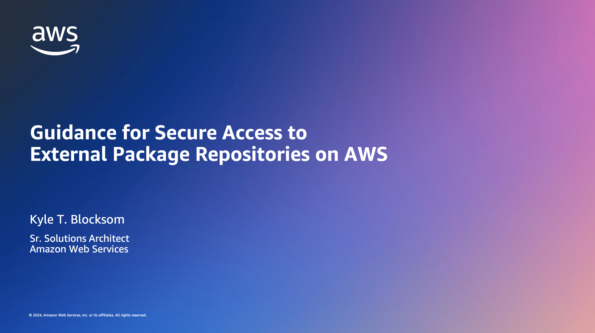
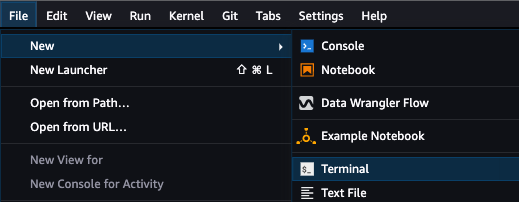
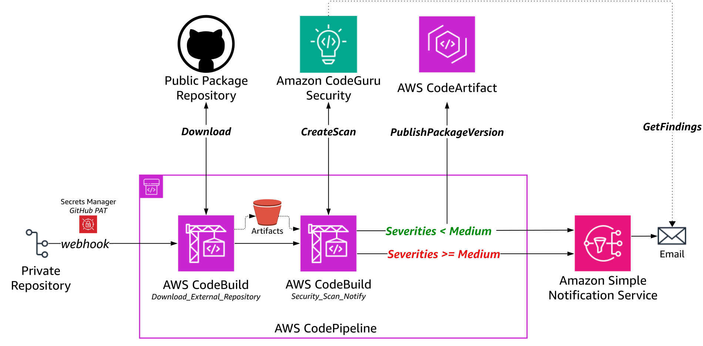

# Guidance for Secure Access to External Package Repositories on AWS


## Table of Contents

1. [Overview](#overview)
    - [Demo Recording](#demo-recording)
    - [Solution Architecture](#solution-architecture)
    - [Cost](#cost)
2. [Prerequisites](#prerequisites)
    - [Operating System](#operating-system)
    - [Multi-Account Configuration](#multi-account-configuration)
    - [Required Permissions](#required-permissions)
    - [Run Security Scan on the CloudFormation Template](#optional-run-security-scan-on-the-cloudFormation-template)
3. [Deployment Steps](#deployment-steps)
    - [Fork and Clone the Repository](#fork-and-clone-the-repository)
    - [Configure VPC Networking](#configure-vpc-networking)
    - [Create GitHub Personal Access Token](#create-github-personal-access-token)
    - [Gather Private Internal Repository Configuration](#gather-private-internal-repository-configuration)
    - [Deploy AWS CloudFormation Stack](#deploy-aws-cloudformation-stack)
4. [Deployment Validation](#deployment-validation)
5. [Running the Guidance](#running-the-guidance)
6. [Next Steps](#next-steps)
7. [Clean Up](#clean-up)

## Overview

This solution demonstrates the deployment of AWS Code Services, including [AWS CodePipeline](https://docs.aws.amazon.com/codepipeline/latest/userguide/welcome.html), [AWS CodeBuild](https://docs.aws.amazon.com/codebuild/latest/userguide/welcome.html),  [Amazon CodeGuru Security](https://docs.aws.amazon.com/codeguru/latest/security-ug/what-is-codeguru-security.html), and [AWS CodeArtifact](https://docs.aws.amazon.com/codeartifact/latest/ug/welcome.html)), to streamline the process for data scientists to access external package dependencies while ensuring Information Security (InfoSec) compliance. Through an automated orchestration pipeline, external packages undergo comprehensive security scans such as static application security testing, software composition analysis, dynamic code analysis, and image vulnerability scanning. Once approved by InfoSec, data scientists gain access to these packages within their private Jupyter Notebook environments, such as [Amazon SageMaker](https://docs.aws.amazon.com/sagemaker/latest/dg/whatis.html). Importantly, InfoSec governance controls are seamlessly integrated to maintain a smooth data science workflow experience without disruptions. Additionally, the solution can be extended to accommodate general developer workflows, where developers utilize external package dependencies.

This solution addresses three primary objectives:
1. Provisioning a self-service workflow for data scientists to request access to external package dependencies.
2. Automating orchestration of security scanning for external package repositories.
3. Establishing and maintaining an InfoSec-compliant private internal package repository.

### Demo Recording
[](https://www.youtube.com/watch?v=x7Xwbuh-C2o "External Package Security: Amazon SageMaker and AWS Code Services - YouTube")

### Solution Architecture

<p align="center">
  <br>
  <span style="display: block; text-align: center;"><em>Figure 1: External Package Repository Security Scanning Workflow</em></span>
</p>

**1 – Data Scientist Self-Service Model**  
Data scientists pull the current version of the [external-package-request.csv](external-package-request.csv) file from the private internal GitHub repository, append desired additional external package repositories to the request record, then push the updated request file back to the private internal repository.

<p align="center">
  <br>
  <span style="display: block; text-align: center;"><em>Figure 2: External Package Request File</em></span>
</p>

**2, 3 – External Package Repository Ingest**  
The CodePipeline _Pull_Internal_Repository_ source action runs based on the external package request file check-in to the private internal GitHub repository, which triggers AWS CodePipeline execution through a webhook secured by a [GitHub personal access token](https://docs.github.com/en/authentication/keeping-your-account-and-data-secure/managing-your-personal-access-tokens) (PAT) stored in [AWS Secrets Manager](https://docs.aws.amazon.com/secretsmanager/latest/userguide/intro.html). The subsequent _Download_External_Repository_ build stage consists of an AWS CodeBuild project that parses the external-package-request.csv file, identifies the external package repository to ingest, and then fetches the remote repository zip URL using _curl_. The remote external package repository is stored as a build stage output artifact in [Amazon Simple Storage Service](https://docs.aws.amazon.com/AmazonS3/latest/userguide/Welcome.html) (S3), encrypted using [AWS Key Management Service](https://docs.aws.amazon.com/kms/latest/developerguide/overview.html) (KMS), and later used as the input artifact for the security test stage.

**4 – Infrastructure Security**  
Centralized Internet egress occurs through a [NAT Gateway](https://docs.aws.amazon.com/vpc/latest/userguide/vpc-nat-gateway.html) (NGW) attached to the egress [Virtual Private Cloud](https://docs.aws.amazon.com/toolkit-for-visual-studio/latest/user-guide/vpc-tkv.html) (VPC) in the Customer Networking Account, reducing costs associated with a distributed model where NGWs are deployed in every spoke VPC. The [Elastic IP](https://docs.aws.amazon.com/AWSEC2/latest/UserGuide/elastic-ip-addresses-eip.html) (EIP) of the NGW provides customers with a single IP address that they can include in their firewall ruleset or allow-list for egress from their private internal network.

**5 – Automated Security Scanning**  
A CodeBuild project runs [CodeGuru Security security scans](https://docs.aws.amazon.com/codeguru/latest/security-ug/how-codeguru-security-works.html) in the _Security_Scan_Notify_ security test stage. CodeGuru Security scanning and finding severity analysis logic is implemented in the [codeguru-security-scan.py](codeguru-security-scan.py) Python script, which is run during the _Security_Scan_Notify_ security test stage.

**6, 7 – Security Results and Private Internal Package Repository Management**  
If the security scans return findings with severities lower than medium, the _Security_Scan_Notify_ stage publishes a new 'Latest' package version to the private internal AWS CodeArtifact package repository that was created during the initial solution deployment. However, if any of the finding severities are medium or higher, no private package version is published to CodeArtifact, and instead, Amazon CodeGuru Security findings are shared for further review. In either case, an [Amazon Simple Notification Service](https://docs.aws.amazon.com/sns/latest/dg/welcome.html) (SNS) topic is used to email the results to the requesting data scientist.

<p align="center">
  <br>
  <span style="display: block; text-align: center;"><em>Figure 3: Amazon SNS Email for AWS CodeArtifact Private Package Name (InfoSec-Approved)</em></span>
</p>

<p align="center">
  <br>
  <span style="display: block; text-align: center;"><em>Figure 4: Amazon SNS Email with Amazon CodeGuru Security Findings (InfoSec-Refused)</em></span>
</p>

**8, 9 – MLOps Workflow**  
Data scientists authenticate to their [Amazon SageMaker Studio](https://docs.aws.amazon.com/sagemaker/latest/dg/studio.html) domain using [AWS Identity Center](https://docs.aws.amazon.com/singlesignon/latest/userguide/what-is.html) or [Identity and Access Management](https://docs.aws.amazon.com/sagemaker/latest/dg/security-iam.html) (IAM) mode. Each auth-mode maps to the user profile’s associated execution role that defines the user’s maximum permissible notebook actions. SageMaker Studio runs on an environment managed by AWS. Studio provides an [elastic network interface](https://docs.aws.amazon.com/AWSEC2/latest/UserGuide/using-eni.html) (ENI) that can be deployed into a customer-managed VPC for more granular control of notebook traffic. Data scientists run their SageMaker Studio Notebook, which installs the InfoSec-approved external packages using the 'Latest' CodeArtifact private package version asset:

```sh
aws codeartifact get-package-version-asset --domain <YOUR-CODEARTIFACT-DOMAIN> \
--repository <YOUR-CODEARTIFACT-PRIVATE-PACKAGE-REPOSITORY> --format generic --namespace <YOUR-CODEARTIFACT-NAMESPACE> \
--package <YOUR-PACKAGE-NAME> --package-version Latest --asset <YOUR-UNIQUE-PACKAGE-VERSION-ASSET>.zip <YOUR-LOCAL-FILE-NAME>.zip 
```

❗This solution also supports a private internal GitHub repository as the target private internal package repository for customers already using GitHub. Data scientists' notebooks will follow the same pattern of installing InfoSec-approved external packages using the private internal repository endpoint (for example, _pip install git+https://github.com/customer-org/new-repo.git)_. You can view the GitHub solution architecture at [assets/images/github-overview.svg](assets/images/github-overview.svg).

### Cost

You are responsible for the cost of the AWS services used while running this Guidance. As of February 2024, the cost for running this Guidance with the default settings in the US East (N. Virginia) AWS Region is approximately $18.315 per month based on the below assumptions.

- Frequency of Pipeline Executions: Pipeline is ran 100 times per day for package updates and scans.
- Size of Packages: Moderate-sized packages being built and scanned, with an average build time of 10 minutes.
- Storage Requirements: Moderate usage, such as 100GB for artifacts and 50GB for the package repository.
- Frequency of Security Scans: Security scans are performed for each package update.
- Compute Resources: Default compute configuration for AWS CodeBuild is used, without any additional EC2 instances.

**AWS CodePipeline ([Pricing](https://aws.amazon.com/codepipeline/pricing/)):**
- Number of Pipelines: 1
- Pipeline Executions per Month: 300
- Estimated Cost: $0 (The first 1000 pipeline executions per month are free).

**AWS CodeBuild ([Pricing](https://aws.amazon.com/codebuild/pricing/)):**
- Build Duration per Execution: 10 minutes
- Number of Build Minutes per Month: 3000
- Estimated Cost: $14.50

Free tier: 100 build minutes per month
Additional build minutes needed: 3000 - 100 = 2900 build minutes
Cost per build minute, assuming small build environment: $0.005
Total cost for 2900 build minutes: $0.005 × 2900 = $14.50

**Amazon S3 ([Pricing](https://aws.amazon.com/s3/pricing/)):**
- Storage: 100GB for artifacts
- Data Transfer Out: N/A
- Requests: Assuming minimal requests, estimate 10,000 requests per month.
- Estimated Cost: $1.415 per month.

Storage:
The free tier includes 5GB of standard storage.
The additional storage needed is 95GB.
Standard storage pricing for Amazon S3 outside of the free tier is typically $0.023 per GB-month for the first 50TB tier.
So, for 95GB, the monthly cost would be:
$0.023/GB-month * 100GB = $1.375

Requests:
The free tier includes 20,000 GET requests and 2000 PUT, COPY, POST, or LIST requests per month.
The additional requests needed are 8000.
Request pricing varies depending on the type of request and region. For standard Amazon S3 requests, it is typically around $0.005 per 1000 requests.
So, for 8000 requests, the monthly cost would be:
$0.005 per 1000 requests * (8000 requests / 1,000) = $0.04

**AWS CodeArtifact ([Pricing](https://aws.amazon.com/codeartifact/pricing/)):**
- Storage: 50GB for packages
- Data Transfer Out: N/A
- Requests: Assuming minimal requests, estimate 10,000 requests per month.
- Estimated Cost: $2.40 per month.

Storage:
The free tier includes 2GB of storage every month.
The additional storage needed is 48GB.
Cost per GB / Month: $0.05 per GB
Monthly cost for storage: $0.05 per GB * 48GB = $2.40

Requests:
The free tier includes the first 100,000 requests every month.

**Amazon CodeGuru Security ([Pricing](https://aws.amazon.com/codeguru/pricing/)):**
- Estimated Cost: $0 per month.
As of February 2024, CodeGuru Security is available for free in public preview.

**Amazon Simple Notification Service ([Pricing](https://aws.amazon.com/sns/pricing/)):**
- Estimated Cost: $0 per month.

Free tier includes:
- One million publishes per month for the first 12 months, starting from the date of sign-up.
- 100,000 HTTP/HTTPS deliveries, email deliveries, email deliveries to Amazon SES and Amazon Pinpoint, and SMS deliveries per month for the first 12 months.

**AWS Secrets Manager ([Pricing](https://aws.amazon.com/secrets-manager/pricing/)):**
- Estimated Cost: $0 per month.

Number of Secrets Stored: 1 (personal access token)

Please note that the actual cost will depend on factors such as the frequency of pipeline executions, the size and complexity of the packages being built and scanned, the amount of data stored in Amazon S3 and AWS CodeArtifact, and the number of security scans performed.

## Prerequisites

### Operating System

You must also have [AWS Command Line Interface](https://aws.amazon.com/cli/) (CLI) installed. For installation instructions, refer to [Installing, updating, and uninstalling the AWS CLI](https://docs.aws.amazon.com/cli/latest/userguide/cli-chap-install.html).

### Multi-Account Configuration
The preceding diagram in Figure 1 highlights a multi-account structure where functional teams are isolated by the security, access, and billing boundaries of their AWS account. This is a proposed multi-account structure that can be adapted for your specific requirements, organizational and governance structure, and project methodology.

The AWS Whitepaper for [Building a Secure Enterprise Machine Learning Platform](https://docs.aws.amazon.com/whitepapers/latest/build-secure-enterprise-ml-platform/aws-accounts.html) recommends production data science environments use multiple AWS accounts for the following benefits:
- Group workloads based on business purpose and ownership
- Apply distinct security controls by environment
- Limit scope of impact from adverse events
- Improve cost visibility and control
- Constrain access to sensitive data

This solution can be expanded upon to follow a multi-account approach by deploying separate CloudFormation stacks into each respective account:
- **Customer Data Science Account:** Contains separate Amazon SageMaker Studio domains per data science team. This account is used by data scientists and ML engineers to perform experimentation and development.
- **Customer Networking Account:** Isolates the networking services, configuration, and operation from the individual application workloads, security, and other infrastructure. 
- **Customer InfoSec Account:** Dedicated to operating security services, monitoring AWS accounts, and automating security alerting and response.

The above multi-account structure can be further sub-divided. Each of these account groups can have multiple AWS accounts per environment for development and testing of services and storing different data classifications: 

❗ For production environments, we recommend the use of two additional account groups:
- **Shared Services Account:** Host common resources like team code repositories, CI/CD pipelines for MLOps workflows, Docker image repositories, [AWS Service Catalog](https://docs.aws.amazon.com/servicecatalog/latest/adminguide/introduction.html) product portfolios, and model registries. 
- **Data Management Account:** Store and manage all data for the machine learning process with strong data security and governance practices using [AWS Data Lake](https://aws.amazon.com/solutions/implementations/data-lake-solution/) and [AWS Lake Formation](https://aws.amazon.com/lake-formation/).

### Required Permissions

By default, AWS CloudFormation uses a temporary session that it generates from your user credentials for stack operations. If you specify a service role, CloudFormation will instead use that role's credentials.

To deploy this solution, your IAM user/role or service role must have permissions to deploy the resources specified in the CloudFormation template. For more details on IAM with CloudFormation, please refer to the [AWS CloudFormation User Guide](https://docs.aws.amazon.com/AWSCloudFormation/latest/UserGuide/using-iam-template.html).

### (OPTIONAL) Run Security Scan on the CloudFormation Template
❗ If you would like to run a security scan on the CloudFormation template using [`cfn_nag`](https://github.com/stelligent/cfn_nag) (recommended), you have to install `cfn_nag`:
```sh
brew install ruby brew-gem
brew gem install cfn-nag
```

To initiate the security scan, run the following command:
```sh
git clone https://github.com/aws-samples/guidance-for-secure-access-to-external-package-repositories-on-aws.git
cd guidance-for-secure-access-to-external-package-repositories-on-aws/cfn/
cfn_nag_scan --input-path ./codeartifact-private-repo.yaml
```

## Deployment Steps

The following workflow diagram illustrates the end-to-end deployment process outlined in this guide. The resultant architecture includes an AWS CodePipeline workflow orchestration triggered by a token-authenticated webhook linked to the private internal GitHub repository containing the external package request file. Within the pipeline, an AWS CodeBuild project is utilized to clone the external package repositories, enalbing another CodeBuild project to conduct Amazon CodeGuru Security security scans. The requesting data scientists are notified regardless of the outcome. However, only InfoSec-approved packages are published to the private internal AWS CodeArtifact (or GitHub) package repository before informing the data scientists. In the case of InfoSec-refused external packages with medium or higher severities, data scientists are provided with CodeGuru Security finding details for further investigation.

<p align="center">
  <br>
  <span style="display: block; text-align: center;"><em>Figure 5: Solution Deployment Workflow</em></span>
</p>

### Fork and Clone the Repository
Follow [GitHub's instructions](https://docs.github.com/en/get-started/quickstart/fork-a-repo?tool=webui&platform=mac) to fork this repository. This action creates a copy of the repository that is disconnected from the original codebase, allowing you to make necessary modifications.

Create a local copy of the forked repository using _git clone_:

```sh
git clone <YOUR-FORKED-REPOSITORY-URL>
```

### Configure VPC Networking
This solution requires private VPC subnets into which you can deploy CodeArtifact, CodeBuild, CodePipeline, Secrets Manager, and SNS [VPC Endpoints](https://docs.aws.amazon.com/whitepapers/latest/aws-privatelink/what-are-vpc-endpoints.html). These subnets must be within a VPC that is also configured with an NGW in a public subnet to facilitate Internet ingress and egress through an IGW for downloading external package repositories.

If your environment lacks the required VPC setup, use the provided [VPC CloudFormation template](https://github.com/awsdocs/aws-lambda-developer-guide/blob/master/templates/vpc-privatepublic.yaml) to create them. After deploying the VPC, make sure to take note of the VPC ID and the IDs of the private subnet(s). These identifiers will be required as CloudFormation parameters later in the [Deploy AWS CloudFormation Stack](#deploy-aws-cloudFormation-stack) section.

### Create GitHub Personal Access Token
To authenticate with your private internal GitHub repository, generate a PAT. You may prefer to use a [GitHub App](https://docs.github.com/en/apps/creating-github-apps/creating-github-apps/about-apps) to access resources on behalf of an organization or for long-lived integrations. To create your PAT, follow GitHub's instructions for [creating a personal access token (classic)](https://docs.github.com/en/authentication/keeping-your-account-and-data-secure/managing-your-personal-access-tokens#creating-a-personal-access-token-classic). Take note of your PAT as it will later be used for AWS Secrets Manager configuration.

### Gather Private Internal Repository Configuration
Your private internal repository, containing [external-package-request.csv](external-package-request.csv) and [codeguru-security-scan.py](codeguru-security-scan.py), serves as the source code repository. Its webhook triggers the CodePipeline source action with each new commit. Navigate to your private internal repository and note the following, which will later be used to set environment variables:
- Branch.
- Owner.
- Name.
  
<p align="center">
  <br>
  <span style="display: block; text-align: center;"><em>Figure 6: Private Internal Repository Configuration</em></span>
</p>

❗ If you are also using GitHub as your private internal package repository, the CloudFormation template, [github-private-repo.yaml.yaml](cfn/github-private-repo.yaml), is used for deploying the solution and requires the private internal GitHub repository URL as an additional parameter.

### Deploy AWS CloudFormation Stack

The following section provides instructions for deploying the parameterized [codeartifact-private-repo.yaml](cfn/codeartifact-private-repo.yaml) CloudFormation template into your AWS account using the [create-codeartifact-stack.sh](shell/create-codeartifact-stack.sh) shell script. 

If you are instead using GitHub as your private internal package repository, deploy the solution using the [create-github-stack.sh](shell/create-github-stack.sh) shell script to deploy the [github-private-repo.yaml.yaml](cfn/github-private-repo.yaml) stack.

The stack (`codeartifact-private-repo.yaml`) provisions the following primary resources:
1. AWS CodeArtifact domain and private internal package repository for managing software packages.
2. Two AWS CodeBuild Projects:
    - DownloadRepoCodeBuild: Downloads the external package repository using the request file.
    - SecurityScanCodeBuild: Performs CodeGuru security scans on the downloaded external packages, publishes InfoSec-approved external packages to private internal CodeArtifact repository (assuming acceptable severity findings), and notifies requesting data scientist of results.
3. AWS CodePipeline source action to establish GitHub webhook and retrieve filtered source changes.
4. AWS CodePipeline to orchestrate the workflow, integrating source actions, CodeBuild projects, and artifact handling.
5. Amazon S3 bucket and AWS KMS key to securely store CodePipeline artifacts.
6. Amazon SNS topic and subscription used for email notifications.
7. Amazon Elastic Cloud Compute (EC2) [security group](https://docs.aws.amazon.com/vpc/latest/userguide/vpc-security-groups.html)) for VPC-attached CodeBuild projects.
8. IAM role and policies:
    - CodeServicesRole: IAM role for AWS Code Services (CodePipeline and CodeBuild).
    - CodeServicesIamPolicy: IAM policy defining permissions for the Code Services role.
    - CodeServicesVpcEndpointPolicy: IAM policy for AWS Code Services VPC Endpoints.

AWS CloudFormation prepopulates stack parameters with the default values provided in the template. To provide alternative input values, you can specify parameters as environment variables that are referenced in the `ParameterKey=<ParameterKey>,ParameterValue=<Value>` pairs in the _aws cloudformation create-stack_ command.

Before deploying the solution, you are required to specify valid name, value, and resource ID environment variables which will be used to set the corresponding CloudFormation parameters:

```sh
# Provide your own parameter values for CloudFormation stack name, CodePipeline pipeline name, and SNS email
export STACK_NAME=<YOUR-STACK-NAME>
export CODEPIPELINE_NAME=<YOUR-CODEPIPELINE-NAME>
export SNS_EMAIL=<YOUR-EMAIL>

# Below parameter values acquired from 'Gather Private Internal Repository Configuration' and 'Create GitHub Personal Access Token' pre-deployment
export PRIVATE_GITHUB_PAT=<YOUR-GITHUB-PAT>
export PRIVATE_GITHUB_BRANCH=<YOUR-PRIVATE-REPOSITORY-BRANCH>
export PRIVATE_GITHUB_OWNER=<YOUR-PRIVATE-REPOSITORY-OWNER>
export PRIVATE_GITHUB_REPO=<YOUR-PRIVATE-REPOSITORY-NAME>

# Below parameter values acquired from 'Configure VPC Networking' pre-deployment
export CODEBUILD_VPC_ID=<YOUR-VPC-ID>
export CODEBUILD_SUBNET_ID1=<YOUR-PRIVATE-SUBNET-ID-1>
export CODEBUILD_SUBNET_ID2=<YOUR-PRIVATE-SUBNET-ID-2>

# (OPTIONAL) Only required with GitHub private package repository, not CodeArtifact
export GITHUB_USER=<YOUR-GITHUB-USERNAME>
export GITHUB_EMAIL=<YOUR-GITHUB-EMAIL>
export PRIVATE_GITHUB_URL=<YOUR-PRIVATE-PACKAGE-REPOSITORY-URL>
```

Run the _create-codeartifact-stack.sh_ shell script to deploy the solution resources defined in the codeartifact-private-repo.yaml CloudFormation template.

```sh
# cd guidance-for-secure-access-to-external-package-repositories-on-aws/shell/
# chmod u+x create-codeartifact-stack.sh

source ./create-codeartifact-stack.sh

# (OPTIONAL) To deploy the github-private-repo.yaml stack, run the below:
# source ./create-github-stack.sh
```

The preceding ```source ./create-codeartifact-stack.sh``` shell command runs the following AWS CLI commands to deploy the solution stack:

```sh
export GITHUB_TOKEN_SECRET_NAME=$(aws secretsmanager create-secret --name $STACK_NAME-git-token --secret-string $PRIVATE_GITHUB_PAT --query Name --output text)
export ACCOUNT_ID=$(aws sts get-caller-identity --query Account --output text)
export S3_ARTIFACTS_BUCKET_NAME=${STACK_NAME}-${ACCOUNT_ID}-codeartifact

aws s3 mb s3://${S3_ARTIFACTS_BUCKET_NAME} --region us-east-1

aws cloudformation create-stack \
--stack-name ${STACK_NAME} \
--template-body file://../cfn/external-repo-codeartifact.yaml \
--parameters \
ParameterKey=S3ArtifactsBucket,ParameterValue=${S3_ARTIFACTS_BUCKET_NAME} \
ParameterKey=CodePipelineName,ParameterValue=${CODEPIPELINE_NAME} \
ParameterKey=SNSEmail,ParameterValue=${SNS_EMAIL} \
ParameterKey=PrivateGitHubBranch,ParameterValue=${PRIVATE_GITHUB_BRANCH} \
ParameterKey=PrivateGitHubOwner,ParameterValue=${PRIVATE_GITHUB_OWNER} \
ParameterKey=PrivateGitHubRepo,ParameterValue=${PRIVATE_GITHUB_REPO} \
ParameterKey=PrivateGitHubToken,ParameterValue=${GITHUB_TOKEN_SECRET_NAME} \
ParameterKey=CodeBuildLambdaVpc,ParameterValue=${CODEBUILD_VPC_ID} \
ParameterKey=CodeBuildLambdaSubnet,ParameterValue=${CODEBUILD_SUBNET_ID1}\\,${CODEBUILD_SUBNET_ID2} \
--capabilities CAPABILITY_IAM

aws cloudformation describe-stacks --stack-name $STACK_NAME --query "Stacks[0].StackStatus"
aws cloudformation wait stack-create-complete --stack-name $STACK_NAME
```

## Deployment Validation

To monitor the CloudFormation stack deployment status, you can either use the [AWS CloudFormation console](https://console.aws.amazon.com/cloudformation/home?region=us-east-1#/stacks?filteringStatus=active&filteringText=&viewNested=true&hideStacks=false) or run the following commands in your terminal:

```
aws cloudformation describe-stacks --stack-name $STACK_NAME --query "Stacks[0].StackStatus"
aws cloudformation wait stack-create-complete --stack-name $STACK_NAME
```

Upon successful stack deployment, the status transitions from `CREATE_IN_PROGRESS` to `CREATE_COMPLETE`.

## Running the Guidance

We are using a token-based webhook to establish a connection from the private internal GitHub repository (containing the external-package-request.csv and codeguru-security-scan.py files) to CodePipeline. This webhook ensures that POST requests sent to the payload URL originate from your private internal repository. With token authentication configured, you will receive the X-Hub-Signature and X-Hub-Signature-256 headers in the webhook POST request.

With your webhook in place, you are prepared to deploy and launch your SageMaker Studio environment. From there, you will pull the current version of the external-package-request.csv file from your private internal GitHub repository, append the desired additional external package repositories to the request file, then push the updated request file back to the private internal repository. This action triggers CodePipeline execution, enalbing scanning of the external package repository for InfoSec approval before making it available as a private internal package.

### Deploy and Launch Amazon SageMaker Studio

This section provides an overview of utilizing SageMaker Studio's system terminal to pull, edit, and push file copies between local and remote repositories. Alternatively, you can run your git commands from your local system terminal or another notebook environment.

You can deploy Amazon SageMaker Studio into a controlled environment with multi-layer security and MLOps pipelines by following the instructions in the [Amazon SageMaker Secure MLOps Guide](https://github.com/aws-samples/amazon-sagemaker-secure-mlops).

#### Amazon SageMaker Studio Private Network Architecture

SageMaker Studio Notebooks allow direct Internet access by default, however, this could provide an additional avenue for unauthorized access or data sharing. To mitigate these risks, you can control your notebook data flows by launching SageMaker Studio in your Amazon Virtual Private Cloud (VPC), where traffic to and from your Studio Domain occurs through an elastic network interface (ENI) in a private VPC subnet. This solution architecture, depicted in the following [VPC-only deployment pattern](https://docs.aws.amazon.com/sagemaker/latest/dg/studio-notebooks-and-internet-access.html#studio-notebooks-and-internet-access-vpc), enables you to restrict Internet access, monitor and inspect traffic using standard AWS networking and security capabilities (for example, [AWS Network Firewall](https://docs.aws.amazon.com/network-firewall/latest/developerguide/what-is-aws-network-firewall.html)), and connect to other AWS resources through [VPC Endpoints powered by AWS PrivateLink](https://aws.amazon.com/privatelink/). The following diagram highlights the centralized network egress inspection architecture, where NGW is a default route target in the private subnet route table for the Inspection VPC. Internet-bound traffic is inspected using AWS Network Firewall before it is routed to the IGW.

<p align="center">
  <br>
  <span style="display: block; text-align: center;"><em>Figure 7: SageMaker Studio Private Networking Architecture</em></span>
</p>

#### Launch Amazon SageMaker Studio

Once Studio is deployed, navigate to the [SageMaker console](https://console.aws.amazon.com/sagemaker/home?#/dashboard), select **Domains** from the menu on the left, then choose your domain.

Under **User profiles**, select your desired user profile, then choose **Studio** from the Launch dropdown to launch your Jupyter Lab environment.

<p align="center">
  <br>
  <span style="display: block; text-align: center;"><em>Figure 8: SageMaker Studio Console</em></span>
</p>

### Push Updated External Package Request File to Private Internal Repository

With your GitHub webhook in place, data scientists operating in SageMaker Studio can pull the current version of the external package request file from the private internal GitHub repository, append desired external package repositories to the request file, then push the updated request file back to the private internal repository.

In the SageMaker Studio IDE, open your system terminal:

<p align="center">
  <br>
  <span style="display: block; text-align: center;"><em>Figure 9: SageMaker Studio JupyterLab Terminal</em></span>
</p>

To clone your private internal GitHub repository and update the external package request file, run the following commands in your terminal:

```sh
git init
git config --global user.email <YOUR-GITHUB-EMAIL>
git config --global user.name <YOUR-GITHUB-USERNAME>
# If not already forked, fork the remote repository (https://github.com/aws-solutions-library-samples/guidance-for-secure-access-to-external-package-repositories-on-aws.git)
git remote add origin <YOUR-FORKED-REPOSITORY-URL> 
git clone <YOUR-FORKED-REPOSITORY-URL> 
cd <local-repo-name>
git checkout <branch>
vi external-package-request.csv
# Append your external package name and zip URL to external-package-request-file.csv # ex: scikit-learn,https://github.com/scikit-learn/scikit-learn/archive/refs/heads/main.zip
# For more information on locating an external package repository's ZIP URL. please see https://docs.github.com/en/repositories/working-with-files/using-files/downloading-source-code-archives
git add external-package-request.csv
git commit -m "Add <PACKAGE-NAME>"
git push -u
```

❗ You will be required to provide your [personal access token](https://docs.github.com/en/authentication/keeping-your-account-and-data-secure/creating-a-personal-access-token) when prompted for your password following the _git push -u_ command.

## CodePipeline Clones External Repository and Performs Security Scans

CodePipeline is configured with a source action triggered by the data scientist's commit to the webhook-enabled GitHub source repository. During CodePipeline orchestration, a CodeBuild project is used to download the remote package repositories so that an additional CodeBuild project can be used to perform security scans on the cloned repository artifacts. You can monit0r CodePipeline's execution status from the [CodePipeline console](https://docs.aws.amazon.com/codepipeline/latest/userguide/pipelines-view-console.html#pipelines-executions-status-console):

<p align="center">
  <br>
  <span style="display: block; text-align: center;"><em>Figure 10: CodePipeline Execution Status</em></span>
</p>

CodeGuru Security conducts security scans on the external package repositories to detect vulnerabilities and return findings. These findings include details about security issues in the external package repository code, the locations of the vulnerabilities in the codebase, and suggestions for remediation. If findins require code changes, CodeGuru Security highlights the vulnerable lines of code and suggests inline fixes. For more information, refer to [Working with findings](https://docs.aws.amazon.com/codeguru/latest/security-ug/working-with-findings.html).

The CodeGuru Security Dashboard offers metrics to monitor the security posture of external package repositories, including open critical findings, severity distribution of findings, and trends over time for each resource. CodeGuru Security tracks the vulnerabilities and trends across multiple revisions of the same resource using the scan name provided during scan creation:

<p align="center">
  <br>
  <span style="display: block; text-align: center;"><em>Figure 11: Amazon CodeGuru Security - Security Scan Findings</em></span>
</p>

---

As part of CodePipeline orchestration, the security test stage output is analyzed. If security scans detect findings of medium or higher severity, an SNS topic is used to email the finding details to the requesting data scientist.

If the security scans return severities lower than medium, CodeBuild updates the private internal CodeArtifact (or GitHub) package repository with a new version of the InfoSec-approved external package. The SNS topic is used to email the new private package name and location for install to the requesting data scientist.

<p align="center">
  <br>
  <span style="display: block; text-align: center;"><em>Figure 12: AWS CodePipeline Private Package Publishing Workflow</em></span>
</p>

You can view the packages published to the CodeArtifact private internal package repository by navigating to the [AWS CodeArtifact Console](https://us-east-1.console.aws.amazon.com/codesuite/codeartifact/start?region=us-east-1):

<p align="center">
  <br>
  <span style="display: block; text-align: center;"><em>Figure 13: AWS CodeArtifact Console</em></span>
</p>

Then download the CodeArtifact private internal package version asset using the [_aws codeartifact get-package-version-asset_](https://awscli.amazonaws.com/v2/documentation/api/latest/reference/codeartifact/get-package-version-asset.html) CLI command.

<p align="center">
  <br>
  <span style="display: block; text-align: center;"><em>Figure 14: AWS CodeArtifact Private Package Version Asset Download</em></span>
</p>

### Utilizing InfoSec-Approved Private Internal Package Repository with SageMaker Studio Notebook

Assuming the data scientist's external package repositories have InfoSec approval, users can use their SageMaker Studio Notebook to download the approved external packages using the newly-created private internal repository package. Please refer to [Download package version assets](https://docs.aws.amazon.com/codeartifact/latest/ug/download-assets.html) from the AWS CodeArtifact User Guide:

```sh
aws codeartifact get-package-version-asset --domain <YOUR-CODEARTIFACT-DOMAIN> \
--repository <YOUR-CODEARTIFACT-PRIVATE-PACKAGE-REPOSITORY> --format generic --namespace <YOUR-CODEARTIFACT-NAMESPACE> \
--package <YOUR-PACKAGE-NAME> --package-version Latest --asset <YOUR-UNIQUE-PACKAGE-VERSION-ASSET>.zip <YOUR-LOCAL-FILE-NAME>.zip 
```

## Next Steps

This Guidance provided a functional overview of a solution that orchestrates the intake and security scanning of external package repositories before their use in data scientists’ notebooks. With a strong security mindset early in their development processes, data scientists are now free to implement their solutions without concerns of a pre-production security scan restarting their development lifecycle. This solution empowers data scientists to take ownership of security by “shifting left” the feedback and accountability for secure open-source library selection to them. Now, in a story of collaboration rather than competing priorities, data science and InfoSec teams are mitigating known threats and preventing future risks from being introduced through code supply chain. 

To test and validate the solution in your own secure data science environment, deploy the solution from this source code GitHub repository into your AWS account and experiment with your own SageMaker Studio Notebooks and other developer workflows.

## Clean Up

To avoid charges in your AWS account, clean up provisioned resources.

### Step 1: Revoke GitHub Personal Access Token

GitHub PATs are configured with an expiration value. To prevent your PAT from being used for programmatic access to your private internal GitHub repository before it reaches its expiry, revoke the PAT by following [GitHub's instructions](https://docs.github.com/en/organizations/managing-programmatic-access-to-your-organization/reviewing-and-revoking-personal-access-tokens-in-your-organization).

### Step 2: Clean Up AWS SageMaker Studio MLOps Projects

AWS SageMaker Studio projects and corresponding Amazon S3 buckets with project and pipeline artifacts will incur a cost in your AWS account. To delete your SageMaker Studio Domain and corresponding applications, notebooks, and data, following the instructions in the [SageMaker Developer Guide](https://docs.aws.amazon.com/sagemaker/latest/dg/gs-studio-delete-domain.html).

### Step 3: Delete `external-repo-codeartifact.yaml` CloudFormation Stack
If you used CodeArtifact as your private internal package repository, use ```./delete-codeartifact-stack.sh``` to delete your solution stack.
If you used GitHub as your private internal package repository, use ```./delete-github-stack.sh``` to delete your solution stack.

The preceding ```source ./delete-codeartifact-stack.sh``` shell command needs to be run from the same working directory in which you deployed the solution stack so that it can reference the appropriate environment variables set during the solution deployment. The shell script runs the following AWS CLI commands to delete the solution stack:

```sh
echo "Emptying and Deleting S3 Bucket: $S3_ARTIFACT_BUCKET_NAME"
aws s3 rm s3://${S3_ARTIFACT_BUCKET_NAME} --recursive
aws s3 rb s3://${S3_ARTIFACT_BUCKET_NAME}

SECURITY_GROUP_ID=$(aws cloudformation describe-stack-resources --stack-name $STACK_NAME --logical-resource-id CodeBuildSecurityGroup --query "StackResources[0].PhysicalResourceId" --output text)
echo "Deleting Security Group ID: $SECURITY_GROUP_ID"
aws ec2 delete-security-group --group-id $SECURITY_GROUP_ID

echo "Deleting CloudFormation Stack: $STACK_NAME"
aws cloudformation delete-stack --stack-name $STACK_NAME
aws cloudformation wait stack-delete-complete --stack-name $STACK_NAME

echo "Deleting Secrets Manager Secret: $GITHUB_TOKEN_SECRET_NAME"
aws secretsmanager delete-secret --secret-id $GITHUB_TOKEN_SECRET_NAME

```

## Disclaimer

*Customers are responsible for making their own independent assessment of the information in this Guidance. This Guidance: (a) is for informational purposes only, (b) represents AWS current product offerings and practices, which are subject to change without notice, and (c) does not create any commitments or assurances from AWS and its affiliates, suppliers or licensors. AWS products or services are provided “as is” without warranties, representations, or conditions of any kind, whether express or implied. AWS responsibilities and liabilities to its customers are controlled by AWS agreements, and this Guidance is not part of, nor does it modify, any agreement between AWS and its customers.*

## Authors

Kyle T. Blocksom, AWS Sr. Solutions Architect
