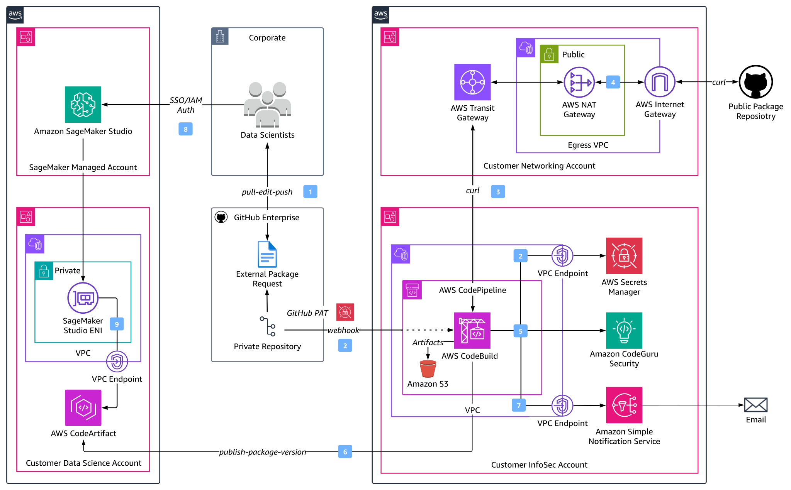
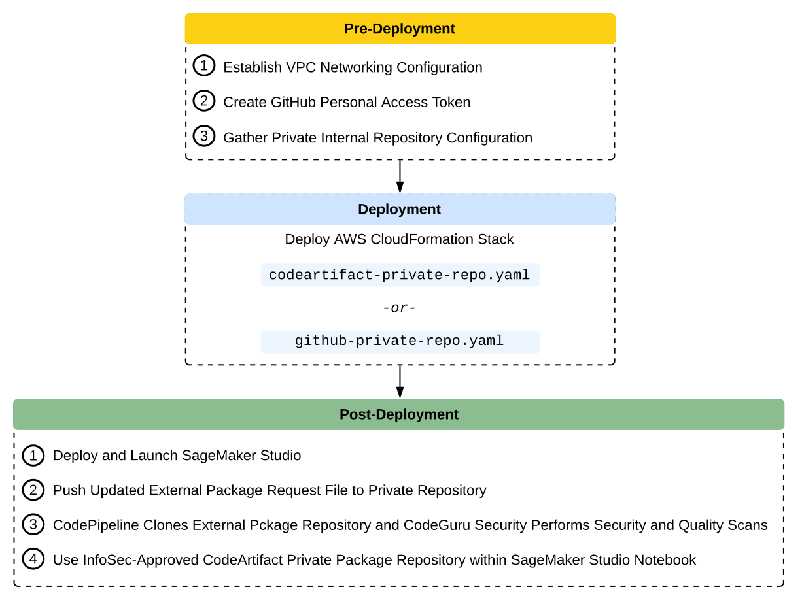
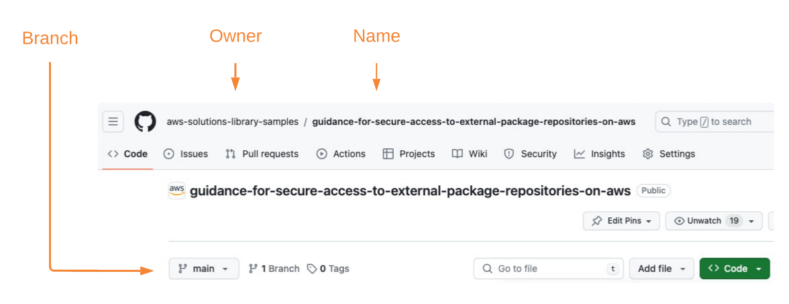

# Guidance for Secure Access to External Package Repositories on AWS


## Table of Contents

1. [Overview](#overview)
    - [Demo Recording](#demo-recording)
    - [Solution Architecture](#solution-architecture)
    - [Cost](#cost)
2. [Prerequisites](#prerequisites-required)
    - [Operating System](#operating-system-required)
    - [Multi-Account Configuration](#multi-account-configuration)
    - [Required Permissions](#required-permissions)
    - [Run Security Scan on the CloudFormation Template](#run-security-scan-on-the-cloudFormation-template)
3. [Deployment Steps](#deployment-steps)
4. [Deployment Validation](#deployment-validation)
5. [Running the Guidance](#running-the-guidance)
6. [Next Steps](#next-steps)
7. [Cleanup](#cleanup)

## Overview

This solution demonstrates the deployment of AWS Code Services (for example, [AWS CodePipeline](https://docs.aws.amazon.com/codepipeline/latest/userguide/welcome.html), [AWS CodeBuild](https://docs.aws.amazon.com/codebuild/latest/userguide/welcome.html),  [Amazon CodeGuru Security](https://docs.aws.amazon.com/codeguru/latest/security-ug/what-is-codeguru-security.html), [AWS CodeArtifact](https://docs.aws.amazon.com/codeartifact/latest/ug/welcome.html)) to streamline the process for data scientists to access external package repositories while ensuring Information Security (InfoSec) compliance. Through an automated orchestration pipeline, public packages undergo comprehensive security scans including static application security testing, software composition analysis, dynamic code analysis, and image vulnerability scanning. Once approved by InfoSec, data scientists gain access to these packages within their private Jupyter Notebook environments (for example, [Amazon SageMaker](https://docs.aws.amazon.com/sagemaker/latest/dg/whatis.html)). Importantly, InfoSec governance controls are seamlessly integrated to maintain a smooth data science workflow experience without disruptions. The solution can also be expanded upon to account for general developer worklfows, where developers leverage external package dependencies.

This solution covers three main topics:
1. Self-service data scientist workflow for using external package repositories.
2. Automated orchestration of external package repository security scanning.
3. Creation and maintenance of InfoSec-compliant private internal package repository.

### Demo Recording
[](https://www.youtube.com/watch?v=x7Xwbuh-C2o "External Package Security: Amazon SageMaker and AWS Code Services - YouTube")

### Solution Architecture

<p align="center">
  
  <em>Figure 1: External Package Repository Security Scanning Workflow</em>
</p>

**1 – Data Scientist Self-Service Model**  
The data scientist pulls the current version of the [public-package-request.csv](public-package-request.csv) file from the private GitHub repository, appends desired additional public package repositories to the request record, then pushes the updated request file back to the private repository.

<p align="center">
  
</p>
<p align="center">
  <em>Figure 2: Public Package Repository Request CSV File</em>
</p>

**2, 3 – External Package Repository Ingest**  
The CodePipeline _Pull_Internal_Repository_ source action executes based on the request file check-in to the private GitHub repository, which triggers AWS CodePipeline execution through a webhook secured by a personal access token stored in [AWS Secrets Manager](https://docs.aws.amazon.com/secretsmanager/latest/userguide/intro.html). The subsequent _Download_External_Repository_ build stage consists of an AWS CodeBuild project that parses the public-package-request.csv file, identifies the public package repository to ingest, then _curls_ the remote repository zip URL. The remote public package repository is stored as a build stage output artifact in [Amazon Simple Storage Service (S3)](https://docs.aws.amazon.com/AmazonS3/latest/userguide/Welcome.html) and later used as the security test stage input artifact.

**4 – Infrastructure Security**  
Centralized Internet egress occurs through a [NAT Gateway](https://docs.aws.amazon.com/vpc/latest/userguide/vpc-nat-gateway.html) (NGW) attached to the egress [Virtual Private Cloud](https://docs.aws.amazon.com/toolkit-for-visual-studio/latest/user-guide/vpc-tkv.html) (VPC) in the Customer Networking Account, reducing the cost associated with a distributed model where NGWs are deployed in every spoke VPC. [The Elastic IP](https://docs.aws.amazon.com/vpc/latest/userguide/vpc-nat-gateway.html) (EIP) of the NGW provides customers with a single IP address that they can include in their allow-list for ingress into other external networks.

**5 – Automated Security Scanning**  
A CodeBuild project executes [CodeGuru Security security and quality scans](https://docs.aws.amazon.com/codeguru/latest/security-ug/how-codeguru-security-works.html) in the _Security_Scan_Notify_ security test stage. CodeGuru Security scanning and finding severity analysis logic is implemented in the [codeguru-security-scan.py](codeguru-security-scan.py) Python script, which is executed during the _Security_Scan_Notify_ security test stage.

**6, 7 – Security Results and Private Package Repository Management**  
If the security scans return lower than medium severities, the _Security_Scan_Notify_ stage publishes a new _Latest_ package version to the private internal CodeArtifact package repository that was created during the initial solution deployment. If any of the finding severities are greater than or equal to medium, then no private package version is published to CodeArtifact. In either case, an [Amazon Simple Notification Service](https://docs.aws.amazon.com/sns/latest/dg/welcome.html) (SNS) topic is used to email the results, positive or negative, to the requesting data scientist.

<p align="center">
  
</p>
<p align="center">
  <em>Figure 3: Amazon SNS Email with AWS CodeArtifact Private Package Name (InfoSec Approved)</em>
</p>

<p align="center">
  
</p>
<p align="center">
  <em>Figure 4: Amazon SNS Email with Amazon CodeGuru Security Findings (InfoSec Refused)</em>
</p>

**8, 9 – MLOps Workflow**  
The data scientist authenticates to their [Amazon SageMaker Studio](https://docs.aws.amazon.com/sagemaker/latest/dg/studio.html) domain via [AWS Identity Center](https://docs.aws.amazon.com/singlesignon/latest/userguide/what-is.html) or [Identity and Access Management (IAM)](https://docs.aws.amazon.com/sagemaker/latest/dg/security-iam.html) mode. Each auth-mode maps to the user profile’s associated execution role that defines the user’s maximum permissible notebook actions. SageMaker Studio runs on an environment managed by AWS. Studio provides an [elastic network interface (ENI)](https://docs.aws.amazon.com/AWSEC2/latest/UserGuide/using-eni.html) that can be deployed into a customer-managed VPC for more granular control of notebook traffic. The data scientist executes their SageMaker Studio Notebook which installs the InfoSec validated external packages using the 'Latest' CodeArtifact private package version asset:

```sh
aws codeartifact get-package-version-asset --domain <YOUR-CODEARTIFACT-DOMAIN> \
--repository <YOUR-CODEARTIFACT-PRIVATE-PACKAGE-REPOSITORY> --format generic --namespace <YOUR-CODEARTIFACT-NAMESPACE> \
--package <YOUR-PACKAGE-NAME> --package-version Latest --asset <YOUR-UNIQUE-PACKAGE-VERSION-ASSET>.zip <YOUR-LOCAL-FILE-NAME>.zip 
```

❗This solution also supports a private internal GitHub repository as the target private package repository for customers already using GitHub. Data scientists' notebooks will follow the same pattern of installing InfoSec validated external packages using the private repository endpoint (for example, _pip install git+https://github.com/customer-org/new-repo.git)_. You can view the GitHub solution architecture at [assets/images/github-overview.svg](assets/images/github-overview.svg).

### Cost

You are responsible for the cost of the AWS services used while running this Guidance. As of February 2024, the cost for running this Guidance with the default settings in the US East (N. Virginia) AWS Region is approximately $18.315 per month based on the below assumptions.

- Frequency of Pipeline Executions: Pipeline is executed 100 times per day for package updates and scans.
- Size of Packages: Moderate-sized packages being built and scanned, with an average build time of 10 minutes.
- Storage Requirements: Moderate usage, such as 100GB for artifacts and 50GB for the package repository.
- Frequency of Security Scans: Security scans are performed for each package update.
- Compute Resources: Default compute configuration for CodeBuild is used, without any additional EC2 instances.

**AWS CodePipeline ([Pricing](https://aws.amazon.com/codepipeline/pricing/)):**
- Number of Pipelines: 1
- Pipeline Executions per Month: 300
- Estimated Cost: $0 (The first 1,000 pipeline executions per month are free).

**AWS CodeBuild ([Pricing](https://aws.amazon.com/codebuild/pricing/)):**
- Build Duration per Execution: 10 minutes
- Number of Build Minutes per Month: 3,000
- Estimated Cost: $14.50

Free tier: 100 build minutes per month
Additional build minutes needed: 3000 - 100 = 2900 build minutes
Cost per build minute, assuming small build environment: $0.005
Total cost for 2900 build minutes: $0.005 × 2900 = $14.50

**Amazon S3 ([Pricing](https://aws.amazon.com/s3/pricing/)):**
- Storage: 100GB for artifacts
- Data Transfer Out: N/A
- Requests: Assuming minimal requests, estimate 10,000 requests per month.
- Estimated Cost: $1.415 per month.

Storage:
The free tier includes 5GB of standard storage.
The additional storage needed is 95GB.
Standard storage pricing for Amazon S3 outside of the free tier is typically $0.023 per GB-month for the first 50TB tier.
So, for 95GB, the monthly cost would be:
$0.023/GB-month * 100GB = $1.375

Requests:
The free tier includes 20,000 GET requests and 2,000 PUT, COPY, POST, or LIST requests per month.
The additional requests needed are 8,000.
Request pricing varies depending on the type of request and region. For standard Amazon S3 requests, it is typically around $0.005 per 1,000 requests.
So, for 8,000 requests, the monthly cost would be:
$0.005 per 1,000 requests * (8,000 requests / 1,000) = $0.04

**AWS CodeArtifact ([Pricing](https://aws.amazon.com/codeartifact/pricing/)):**
- Storage: 50GB for packages
- Data Transfer Out: N/A
- Requests: Assuming minimal requests, estimate 10,000 requests per month.
- Estimated Cost: $2.40 per month.

Storage:
The free tier includes 2GB of storage every month.
The additional storage needed is 48GB.
Cost per GB / Month: $0.05 per GB
Monthly cost for storage: $0.05 per GB * 48GB = $2.40

Requests:
The free tier includes the first 100,000 requests every month.

**Amazon CodeGuru Security ([Pricing](https://aws.amazon.com/codeguru/pricing/)):**
- Estimated Cost: $0 per month.
As of February 2024, CodeGuru Security is available for free in public preview.

**Amazon Simple Notification Service ([Pricing](https://aws.amazon.com/sns/pricing/)):**
- Estimated Cost: $0 per month.

Free tier includes:
- One million publishes per month for the first 12 months, starting from the date of sign-up.
- 100,000 HTTP/HTTPS deliveries, email deliveries, email deliveries to Amazon SES and Amazon Pinpoint, and SMS deliveries per month for the first 12 months.

**AWS Secrets Manager ([Pricing](https://aws.amazon.com/secrets-manager/pricing/)):**
- Estimated Cost: $0 per month.

Number of Secrets Stored: 1 (personal access token)

Please note that the actual cost will depend on factors such as the frequency of pipeline executions, the size and complexity of the packages being built and scanned, the amount of data stored in S3 and CodeArtifact, and the number of security scans performed.

## Prerequisites

### Operating System

You must also have [AWS CLI](https://aws.amazon.com/cli/) installed. For instructions on installing AWS CLI, please see [Installing, updating, and uninstalling the AWS CLI](https://docs.aws.amazon.com/cli/latest/userguide/cli-chap-install.html).

### Multi-Account Configuration
The preceding diagram in Figure 1 highlights a multi-account structure where functional teams are isolated by the security, access, and billing boundaries of their AWS account. This is a proposed multi-account structure that can be adapted for your specific requirements, organizational and governance structure, and project methodology.

The AWS Whitepaper for [Building a Secure Enterprise Machine Learning Platform](https://docs.aws.amazon.com/whitepapers/latest/build-secure-enterprise-ml-platform/aws-accounts.html) recommends production data science environments use multiple AWS accounts for the following benefits:
- Group workloads based on business purpose and ownership
- Apply distinct security controls by environment
- Limit scope of impact from adverse events
- Improve cost visibility and control
- Constrain access to sensitive data

This solution can be expanded upon to follow a multi-account approach by deploying separate CloudFormation stacks into each respective account:
- **Customer Data Science Account:** Contains separate Amazon SageMaker Studio domains per data science team. This account is used by data scientists and ML engineers to perform experimentation and development.
- **Customer Networking Account:** Isolates the networking services, configuration, and operation from the individual application workloads, security, and other infrastructure. 
- **Customer InfoSec Account:** Dedicated to operating security services, monitoring AWS accounts, and automating security alerting and response.

The above multi-account structure can be further sub-divided. Each of these account groups can have multiple AWS accounts per environment for development and testing of services and storing different data classifications: 

❗ For production environments, we recommend the use of two additional account groups:
- **Shared Services Account:** Host common resources like team code repositories, CI/CD pipelines for MLOps workflows, Docker image repositories, [AWS Service Catalog](https://docs.aws.amazon.com/servicecatalog/latest/adminguide/introduction.html) product portfolios, and model registries. 
- **Data Management Account:** Store and manage all data for the machine learning process with strong data security and governance practices using [AWS Data Lake](https://aws.amazon.com/solutions/implementations/data-lake-solution/) and [AWS Lake Formation](https://aws.amazon.com/lake-formation/).

### Required Permissions

By default, AWS CloudFormation uses a temporary session that it generates from your user credentials for stack operations. If you specify a service role, CloudFormation will instead use that role's credentials.

To deploy this solution, your IAM user/role or service role must have permissions to deploy the resources specified in the CloudFormation template. For more details on AWS Identity and Access Management (IAM) with CloudFormation, please refer to the [AWS CloudFormation User Guide](https://docs.aws.amazon.com/AWSCloudFormation/latest/UserGuide/using-iam-template.html).

### (OPTIONAL) Run Security Scan on the CloudFormation Template
❗ If you would like to run a security scan on the CloudFormation template using [`cfn_nag`](https://github.com/stelligent/cfn_nag) (recommended), you have to install `cfn_nag`:
```sh
brew install ruby brew-gem
brew gem install cfn-nag
```

To initiate the security scan, run the following command:
```sh
git clone https://github.com/aws-samples/guidance-for-secure-access-to-external-package-repositories-on-aws.git
cd guidance-for-secure-access-to-external-package-repositories-on-aws/cfn/
cfn_nag_scan --input-path ./external-repo-codeartifact.yaml
```

## Deployment Steps

The below workflow diagram visualizes the end-to-end deployment process that is detailed within this guide. The resultant architecture includes an AWS CodePipeline workflow orchestration that triggers based on a token-authenticated webhook with the private GitHub repository containing the public package repository request file. The workflow consists of an AWS CodeBuild project to clone remote external package repositories so that an additional CodeBuild project can be used to execute Amazon CodeGuru Security security and quality scans, then publish InfoSec-approved packages to a private internal AWS CodeArtifact (or GitHub) package repository before notifying the requesting data scientist.

<p align="center">
  
  <em>Figure 5: Solution Deployment Workflow</em>
</p>

### Fork and Clone [Guidance for Secure Access to External Package Repositories on AWS](https://github.com/aws-solutions-library-samples/guidance-for-secure-access-to-external-package-repositories-on-aws.git)
Follow [GitHub's instructions](https://docs.github.com/en/get-started/quickstart/fork-a-repo?tool=webui&platform=mac) to fork this repository. This creates a copy of the repository that is disconnected from the original codebase, so you can make the appropriate modifications.

Take note of your forked repository URL and use it to clone the repository:

```sh
git clone <YOUR-FORKED-REPOSITORY-URL>
```

### Establish VPC Networking Configuration
This solution requires private VPC subnets into which you can deploy CodeArtifact, CodeBuild, and CodePipeline [VPC Endpoints](https://docs.aws.amazon.com/whitepapers/latest/aws-privatelink/what-are-vpc-endpoints.html). These private subnets must be deployed into a VPC that is also configured with a NAT Gateway (NGW) in a public subnet to facilitate Internet ingress and egress through an Internet Gateway (IGW) to download external package repositories.

If your environment does not have the required VPC, subnets, NAT Gateway, and Internet Gateway configuration, you can create those by launching the following [CloudFormation template](https://github.com/awsdocs/aws-lambda-developer-guide/blob/master/templates/vpc-privatepublic.yaml).

Your VPC ID and two private subnet IDs will be specified as CloudFormation parameters later in the [Deploy AWS CloudFormation Stack](#deploy-aws-cloudFormation-stack) section.

### Create Personal Access Token (PAT)
To authenticate with your private GitHub repository, you will use a GitHub PAT. You may prefer to use a [GitHub App](https://docs.github.com/en/apps/creating-github-apps/creating-github-apps/about-apps) to access resources on behalf of an organization or for long-lived integrations. To create your PAT, please follow the GitHub instructions for [creating a personal access token (classic)](https://docs.github.com/en/authentication/keeping-your-account-and-data-secure/managing-your-personal-access-tokens#creating-a-personal-access-token-classic). Take note of your PAT before closing your browser as you will use it for AWS Secrets Manager configuration below.

The [Deployment Automation Script](shell/create-codeartifact-stack.sh), which you will use in the following Deploy AWS CloudFormation Stack section, will publish your PAT to AWS Secrets Manager using AWS CLI commands and the secret name will be used as the _PrivateGitHubToken_ CloudFormation parameter.

### Gather Private Internal Repository Configuration
Your private internal repository is the source code repository that contains [public-package-request.csv](public-package-request.csv) and [codeguru-security-scan.py](codeguru-security-scan.py). This repository's webhook is used as the CodePipeline source action that triggers with each new _git push_. Please navigate to your private internal repository and note the following:
- Branch.
- Owner.
- Name.
  
<p align="center">
  
  <em>Figure 6: Private Repository Configuration</em>
</p>

❗ If you are also using GitHub as your private internal package repository, the CloudFormation template, [external-repo-github.yaml](cfn/external-repo-github.yaml), is used for deploying the solution and requires the private internal GitHub repository URL as an additional parameter.

### Deploy AWS CloudFormation Stack

The following section provides instructions for deploying the parameterized [external-repo-codeartifact.yaml](cfn/external-repo-codeartifact.yaml) CloudFormation template into your AWS account. You can also deploy the solution using the [create-codeartifact-stack.sh](shell/create-codeartifact-stack.sh) shell script. Please note: if you are using GitHub instead of AWS CodeArtifact as your private internal package repository, you will use the [create-github-stack.sh](shell/create-github-stack.sh) shell script to deploy the [external-repo-github.yaml](cfn/external-repo-github.yaml) stack.

The stack (`external-repo-codeartifact.yaml`) provisions the following primary resources:
1. CodePipeline Pipeline to orchestrate solution workflow.
2. CodePipeline Artifact Bucket and KMS Key to securely store compressed stage input and output artifacts.
3. CodePipeline Source Action _Pull_Internal_Repository_ to establish GitHub webhook and retrieve filtered source changes.
4. CodePipeline Build Stage _Download_External_Repository_ to curl external package repository zip URL.
5. CodePipeline Security Test Stage _Security_Scan_Notify_ to execute CodeGuru Security security and quality scans, publish InfoSec validated external packages to internal private CodeArtifact repository (assuming acceptable severity findings), and notify requesting data scientist of results.

CloudFormation prepopulates stack parameters with the default values provided in the template. To provide alternative input values, you can specify parameters via `ParameterKey=<ParameterKey>,ParameterValue=<Value>` pairs in the `aws cloudformation create-stack` call. 

❗You are required to specify valid CloudFormation parameters for your prerequisite AWS resources (for example, VPC, subnets, S3 bucket) and GitHub environment settings (for example, PrivateGitHubBranch, PrivateGitHubOwner, PrivateGitHubRepo, PrivateGitHubToken) during stack deployment. Set the corresponding CloudFormation parameters to the names, values, and resource IDs of your existing resources:

```sh
# Provide your own parameter values for CloudFormation stack name, CodePipeline pipeline name, and SNS email
export STACK_NAME=<YOUR-STACK-NAME>
export CODEPIPELINE_NAME=<YOUR-CODEPIPELINE-NAME>
export SNS_EMAIL=<YOUR-EMAIL>

# Below parameter values acquired from 'Gather Private Internal Repository Configuration' and 'Create GitHub Personal Access Token' pre-deployment
export PRIVATE_GITHUB_PAT=<YOUR-GITHUB-PAT>
export PRIVATE_GITHUB_BRANCH=<YOUR-PRIVATE-REPOSITORY-BRANCH>
export PRIVATE_GITHUB_OWNER=<YOUR-PRIVATE-REPOSITORY-OWNER>
export PRIVATE_GITHUB_REPO=<YOUR-PRIVATE-REPOSITORY-NAME>

# Below parameter values acquired from 'Establish VPC Networking Configuration' pre-deployment
export CODEBUILD_VPC_ID=<YOUR-VPC-ID>
export CODEBUILD_SUBNET_ID1=<YOUR-PRIVATE-SUBNET-ID-1>
export CODEBUILD_SUBNET_ID2=<YOUR-PRIVATE-SUBNET-ID-2>

# (OPTIONAL) Only required with GitHub private package repository, not CodeArtifact
export GITHUB_USER=<YOUR-GITHUB-USERNAME>
export GITHUB_EMAIL=<YOUR-GITHUB-EMAIL>
export PRIVATE_GITHUB_URL=<YOUR-PRIVATE-PACKAGE-REPOSITORY-URL>
```

```sh
# cd guidance-for-secure-access-to-external-package-repositories-on-aws/shell/
# chmod u+x create-codeartifact-stack.sh

source ./create-codeartifact-stack.sh

# (OPTIONAL) To deploy external-repo-github.yaml stack, execute the below:
# source ./create-github-stack.sh
```

#### Deployment Automation Script
The above ```source ./create-codeartifact-stack.sh``` shell command executes the following AWS CLI commands to deploy the solution stack:

```sh
export GITHUB_TOKEN_SECRET_NAME=$(aws secretsmanager create-secret --name $STACK_NAME-token-3 --secret-string $PRIVATE_GITHUB_PAT --query Name --output text)
export ACCOUNT_ID=$(aws sts get-caller-identity --query Account --output text)
export S3_ARTIFACT_BUCKET_NAME=${STACK_NAME}-${ACCOUNT_ID}-codeartifact

aws s3 mb s3://${S3_ARTIFACT_BUCKET_NAME} --region us-east-1

aws cloudformation create-stack \
--stack-name ${STACK_NAME} \
--template-body file://../cfn/external-repo-codeartifact.yaml \
--parameters \
ParameterKey=ArtifactStoreBucket,ParameterValue=${S3_ARTIFACT_BUCKET_NAME} \
ParameterKey=CodePipelineName,ParameterValue=${CODEPIPELINE_NAME} \
ParameterKey=SNSEmail,ParameterValue=${SNS_EMAIL} \
ParameterKey=PrivateGitHubBranch,ParameterValue=${PRIVATE_GITHUB_BRANCH} \
ParameterKey=PrivateGitHubOwner,ParameterValue=${PRIVATE_GITHUB_OWNER} \
ParameterKey=PrivateGitHubRepo,ParameterValue=${PRIVATE_GITHUB_REPO} \
ParameterKey=PrivateGitHubToken,ParameterValue=${GITHUB_TOKEN_SECRET_NAME} \
ParameterKey=CodeBuildLambdaVpc,ParameterValue=${CODEBUILD_VPC_ID} \
ParameterKey=CodeBuildLambdaSubnet,ParameterValue=${CODEBUILD_SUBNET_ID1}\\,${CODEBUILD_SUBNET_ID2} \
--capabilities CAPABILITY_IAM

aws cloudformation describe-stacks --stack-name $STACK_NAME --query "Stacks[0].StackStatus"
aws cloudformation wait stack-create-complete --stack-name $STACK_NAME

```

## Deployment Validation

You can track the CloudFormation stack deployment status in [AWS CloudFormation console](https://console.aws.amazon.com/cloudformation/home?region=us-east-1#/stacks?filteringStatus=active&filteringText=&viewNested=true&hideStacks=false) or in your terminal with the following commands:

```
aws cloudformation describe-stacks --stack-name $STACK_NAME --query "Stacks[0].StackStatus"
aws cloudformation wait stack-create-complete --stack-name $STACK_NAME
```

After a successful stack deployment, the status changes from `CREATE_IN_PROGRESS` to `CREATE_COMPLETE`.

## Running the Guidance

We are using a token-based webhook to connect from the private GitHub repository (containing the public-package-request.csv and codeguru-security-scan.py files) to CodePipeline. The webhook token ensures that POST requests sent to the payload URL originate from your private repository. When you set a token, you will receive the X-Hub-Signature and X-Hub-Signature-256 headers in the webhook POST request.

With your webhook in place, you are now ready to deploy and launch your SageMaker Studio environment. From your SageMaker Studio environment, you will pull the current version of the public-package-request.csv file from your private GitHub repository, append the desired additional public repository to the request record, then push the updated request file back to the private repository. This will trigger CodePipeline execution so the external package repository can be scanned for InfoSec approval then made available as a private internal package.

### Deploy and Launch SageMaker Studio

This section provides an overview of how to use SageMaker Studio's system terminal to pull, edit, and push file copies between local and remote repositories. You can alternatively execute your git commands from your local system terminal or other notebook environment.

You can deploy Amazon SageMaker Studio into a controlled environment with multi-layer security and MLOps pipelines by following the instructions in the [Amazon SageMaker Secure MLOps Guide](https://github.com/aws-samples/amazon-sagemaker-secure-mlops).

SageMaker Studio Notebooks allow direct Internet access by default, however, this could provide an additional avenue for unauthorized access or sharing of your data. You can control your notebook data flows by launching SageMaker Studio in your Amazon Virtual Private Cloud (VPC), where traffic to and from your Studio Domain occurs through an elastic network interface (ENI) in a private VPC subnet. This solution architecture follows the [VPC-only deployment pattern](https://docs.aws.amazon.com/sagemaker/latest/dg/studio-notebooks-and-internet-access.html#studio-notebooks-and-internet-access-vpc) shown below, allowing you to restrict Internet access, monitor and inspect traffic using standard AWS networking and security capabilities (for example, [AWS Network Firewall](https://docs.aws.amazon.com/network-firewall/latest/developerguide/what-is-aws-network-firewall.html)), and connect to other AWS resources through [VPC Endpoints powered by AWS PrivateLink](https://aws.amazon.com/privatelink/). The diagram below highlights the centralized network egress inspection architecture, where NAT Gateway (NGW) is a default route target in the private subnet route table for the Inspection VPC. Internet-bound traffic is inspected using AWS Network Firewall before it is routed to the Internet Gateway (IGW).

<p align="center">
  
</p>
<p align="center">
  <em>Figure 7: SageMaker Studio Private Networking Architecture</em>
</p>

Once Studio is deployed, navigate to the [SageMaker console](https://console.aws.amazon.com/sagemaker/home?#/dashboard), select **Studio** from the menu on the left, select your **user profile** from the dropdown, then select **Open Studio**. This will launch your Jupyter Lab environment.

<p align="center">
  
</p>
<p align="center">
  <em>Figure 8: SageMaker Studio Console</em>
</p>

### Push Updated External Package Repository Request File to Private Repository

With your GitHub webhook in place, data scientists operating in SageMaker Studio can pull the current version of the public repository request CSV file from the private GitHub repository, append desired additional public repositories to the request record, then push the updated request file back to the private repository.

In the SageMaker Studio IDE, open your system terminal:

<p align="center">
  
</p>
<p align="center">
  <em>Figure 9: SageMaker Studio JupyterLab Terminal</em>
</p>

Run the following commands in the terminal to clone your private GitHub repository then update and push your public repository request CSV file:

```sh
git init
git config --global user.email <YOUR-GITHUB-EMAIL>
git config --global user.name <YOUR-GITHUB-USERNAME>
# If not already forked, fork the remote repository (https://github.com/aws-samples/sagemaker-external-repository-security.git)
git remote add origin <YOUR-FORKED-REPOSITORY-URL> 
git clone <YOUR-FORKED-REPOSITORY-URL> 
cd <local-repo-name>
git checkout <branch>
vi <public-package-request.csv>
# Append your public package name and zip URL to public-repo-request-file.csv # ex: scikit-learn,https://github.com/scikit-learn/scikit-learn/archive/refs/heads/main.zip
git add <public-package-request.csv>
git commit -m "Add <PACKAGE-NAME>"
git push -u
```

❗ You will be required to provide your [personal access token](https://docs.github.com/en/authentication/keeping-your-account-and-data-secure/creating-a-personal-access-token) when prompted for your password following the _git push -u_ command.

## CodePipeline Clones External Repository and Performs Security Scans

CodePipeline is configured with a source action that triggers based on the data scientist's commit to the webhook-enabled GitHub source repository. CodePipeline execution then orchestrates the CodeBuild project to download the remote package repository so that an additional CodeBuild project can be used to perform security scans on the cloned repository artifact. You can view CodePipeline's execution status from the [CodePipeline console](https://docs.aws.amazon.com/codepipeline/latest/userguide/pipelines-view-console.html#pipelines-executions-status-console):

<p align="center">
  
</p>
<p align="center">
  <em>Figure 10: CodePipeline Execution Status</em>
</p>

CodeGuru Security performs security and quality scans on the public package repository to detect vulnerabilities and return findings. The findings include information about security issues in the public package repository code, the vulnerabilities' locations in the codebase, and suggestions for how to remediate them. If the finding includes a code change, CodeGuru Security highlights the vulnerable lines of code to remove and suggests inline code fixes as replacements. For more information, see [Working with findings](https://docs.aws.amazon.com/codeguru/latest/security-ug/working-with-findings.html).

The CodeGuru Security Dashboard provides metrics to track the security posture of your public package repositories, including open critical findings, severity distribution of findings, and trends over time for each resource. CodeGuru Security tracks the vulnerabilities and trends across multiple revisions of the same resource using the scan name provided when a scan is created:

<p align="center">
  
  <em>Figure 11: Amazon CodeGuru Security - Security and Quality Scan Findings</em>
</p>

---

The security test stage output is analyzed as part of the CodePipeline orchestration. If the security scans return severity findings greater than or equal to medium, then [CodeBuild stop build](https://boto3.amazonaws.com/v1/documentation/api/latest/reference/services/codebuild/client/stop_build.html) is used to stop the build process, and an Amazon Simple Notification (SNS) topic is used to email the negative results to the requesting data scientist.

If the security scans return lower than medium severities, CodeBuild updates the private CodeArtifact (or GitHub) package repository with a new version of the InfoSec approved external package and the SNS topic is used to email the positive results to the requesting data scientist.

<p align="center">
  
  <em>Figure 12: AWS CodePipeline Private Package Publishing Workflow</em>
</p>

You can view the packages published to the CodeArtifact private internal package repository by navigating to the [AWS CodeArtifact Console](https://us-east-1.console.aws.amazon.com/codesuite/codeartifact/start?region=us-east-1):

<p align="center">
  
  <em>Figure 13: AWS CodeArtifact Console</em>
</p>

Then download the CodeArtifact private internal package version asset using the [_aws codeartifact get-package-version-asset_ CLI command](https://awscli.amazonaws.com/v2/documentation/api/latest/reference/codeartifact/get-package-version-asset.html).

<p align="center">
  
</p>
<p align="center">
  <em> Figure 14: AWS CodeArtifact Private Package Version Asset Download</em>
</p>

### Use InfoSec Approved Private Package Repository with SageMaker Studio Notebook

Assuming the data scientist's external package repository has been approved by InfoSec, users can use their SageMaker Studio Notebook to download the validated external packages using the newly-created private repository package - Please see [Download package version assets](https://docs.aws.amazon.com/codeartifact/latest/ug/download-assets.html) from the AWS CodeArtifact User Guide:

```sh
aws codeartifact get-package-version-asset --domain <YOUR-CODEARTIFACT-DOMAIN> \
--repository <YOUR-CODEARTIFACT-PRIVATE-PACKAGE-REPOSITORY> --format generic --namespace <YOUR-CODEARTIFACT-NAMESPACE> \
--package <YOUR-PACKAGE-NAME> --package-version Latest --asset <YOUR-UNIQUE-PACKAGE-VERSION-ASSET>.zip <YOUR-LOCAL-FILE-NAME>.zip 
```

## Next Steps

This Guidance provided a functional overview of a solution that orchestrates the intake and security scanning of external package repositories before they are used in data scientists’ notebooks. With a strong security mindset early in their development processes, data scientists are now free to implement their solutions without worrying that a pre-production security scan will restart their development lifecycle. This solution empowers data scientists to take ownership of security by “shifting left” the feedback and accountability for secure open-source library selection to the data scientists. Now, in a story of collaboration rather than competing priorities, data science and InfoSec teams are taking measures to mitigate known threats and prevent future risks from being introduced through code supply chain. 

To test and validate the solution in your own secure data science environment, deploy the solution from this source code GitHub repository into your AWS account and experiment with your own SageMaker Studio Notebooks and other developer workflows.

## Clean Up

You must clean up provisioned resources to avoid charges in your AWS account.

### Step 1: Revoke GitHub Personal Access Token

GitHub PATs are configured with an expiration value. If you want to ensure that your PAT cannot be used for programmatic access to your internal private GitHub repository before it reaches its expiry, you can revoke the PAT by following [GitHub's instructions](https://docs.github.com/en/organizations/managing-programmatic-access-to-your-organization/reviewing-and-revoking-personal-access-tokens-in-your-organization).

### Step 2: Clean Up SageMaker Studio MLOps Projects

SageMaker Studio projects and corresponding S3 buckets with project and pipeline artifacts will incur a cost in your AWS account. To delete your SageMaker Studio Domain and corresponding applications, notebooks, and data, please following the instructions in the [SageMaker Developer Guide](https://docs.aws.amazon.com/sagemaker/latest/dg/gs-studio-delete-domain.html).

### Step 3: Delete `external-repo-codeartifact.yaml` CloudFormation Stack
If you used CodeArtifact as your private internal package repository, use ```./delete-codeartifact-stack.sh``` to delete your solution stack.
If you used GitHub as your private internal package repository, use ```./delete-github-stack.sh``` to delete your solution stack.

The above shell command needs to be executed from the same working directory in which you deployed the solution stack so that it can reference the appropriate environment variables that were set as part of the deployment automation script. 
The shell command executes the following AWS CLI commands to delete the solution stack:

#### Clean Up Automation Script

```sh
# cd guidance-for-secure-access-to-external-package-repositories-on-aws/shell/
# chmod u+x delete-codeartifact-stack.sh
# ./delete-codeartifact-stack.sh

echo "Deleting CloudFormation Stack: $STACK_NAME"
echo "Deleting Secrets Manager Secret: $GITHUB_TOKEN_SECRET_NAME"
echo "Emptying and Deleting S3 Bucket: $S3_ARTIFACT_BUCKET_NAME"

aws s3 rm s3://${S3_ARTIFACT_BUCKET_NAME} --recursive
aws s3 rb s3://${S3_ARTIFACT_BUCKET_NAME}

aws cloudformation delete-stack --stack-name $STACK_NAME
aws cloudformation wait stack-delete-complete --stack-name $STACK_NAME

aws secretsmanager delete-secret --secret-id $GITHUB_TOKEN_SECRET_NAME
```

## Disclaimer

*Customers are responsible for making their own independent assessment of the information in this Guidance. This Guidance: (a) is for informational purposes only, (b) represents AWS current product offerings and practices, which are subject to change without notice, and (c) does not create any commitments or assurances from AWS and its affiliates, suppliers or licensors. AWS products or services are provided “as is” without warranties, representations, or conditions of any kind, whether express or implied. AWS responsibilities and liabilities to its customers are controlled by AWS agreements, and this Guidance is not part of, nor does it modify, any agreement between AWS and its customers.*

## Authors

Kyle T. Blocksom, AWS Sr. Solutions Architect
